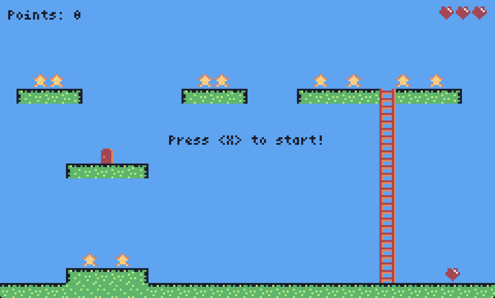

# Blutti

A single screen platformer game with 8x8 tiles for the Firefly Zero handheld
console.

Develeoped with the Rust programming language.

## Firefly Zero

Firefly Zero is a modern handheld game console with effortless multiplayer. It's fun to play, alone or with friends, and easy to program.

https://fireflyzero.com/

## Credits

- Programming: Olle Wreede
- Graphics: Olle Wreede
- Music: Zane Little Music
- SFX: @Shades, Luke.RUSTLTD, sauer2
- Map editor: [Tiled](https://www.mapeditor.org/)

## License

Published under the MIT License.
