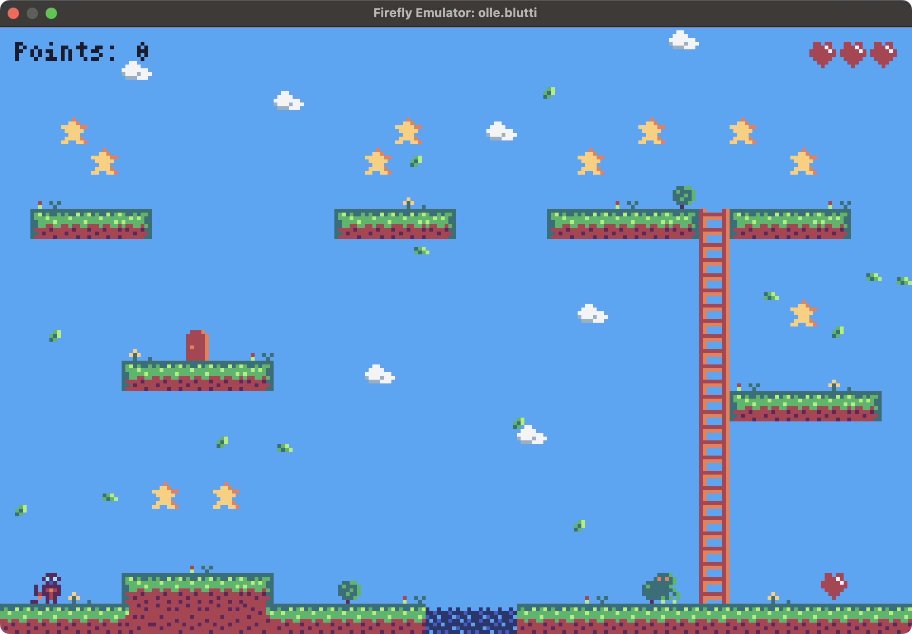
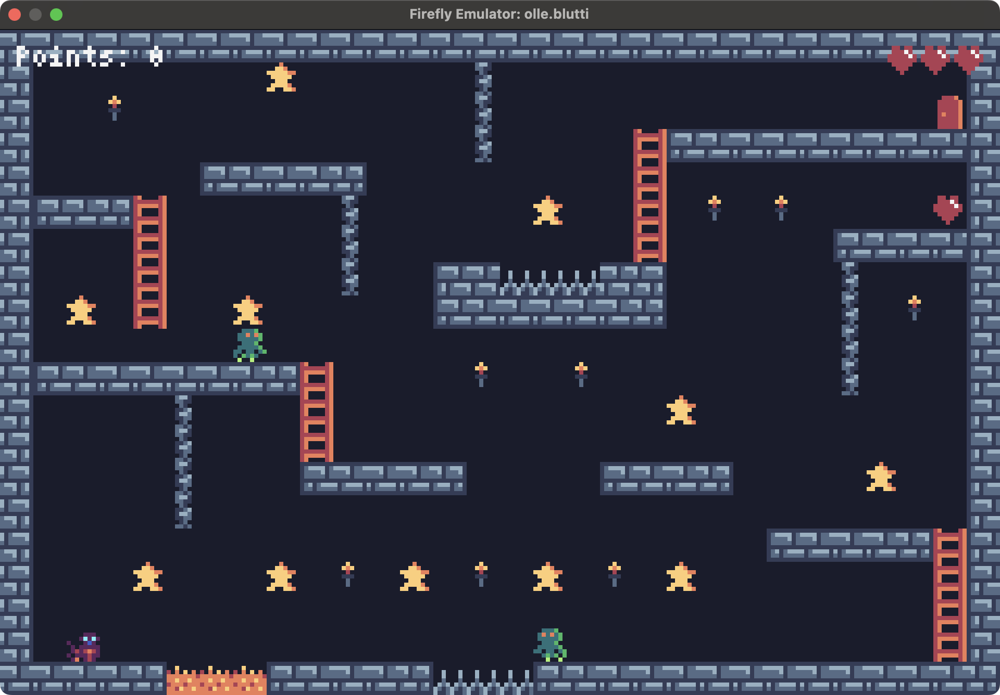
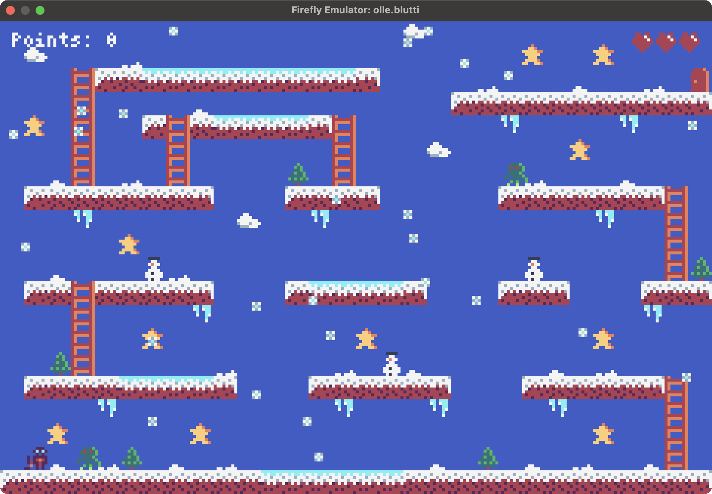
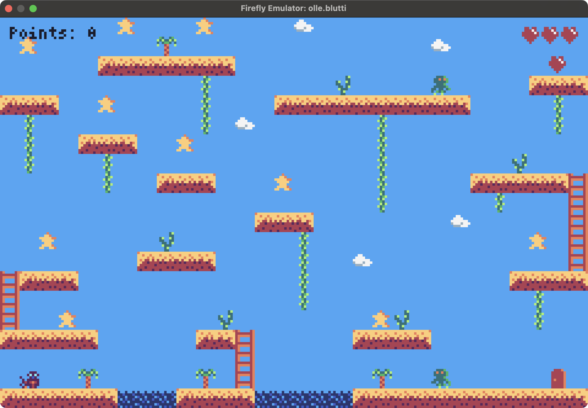
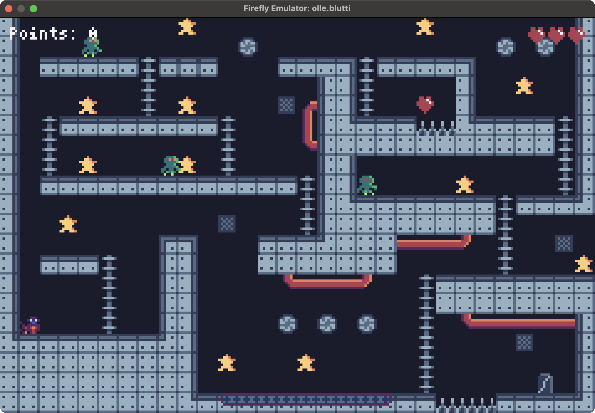
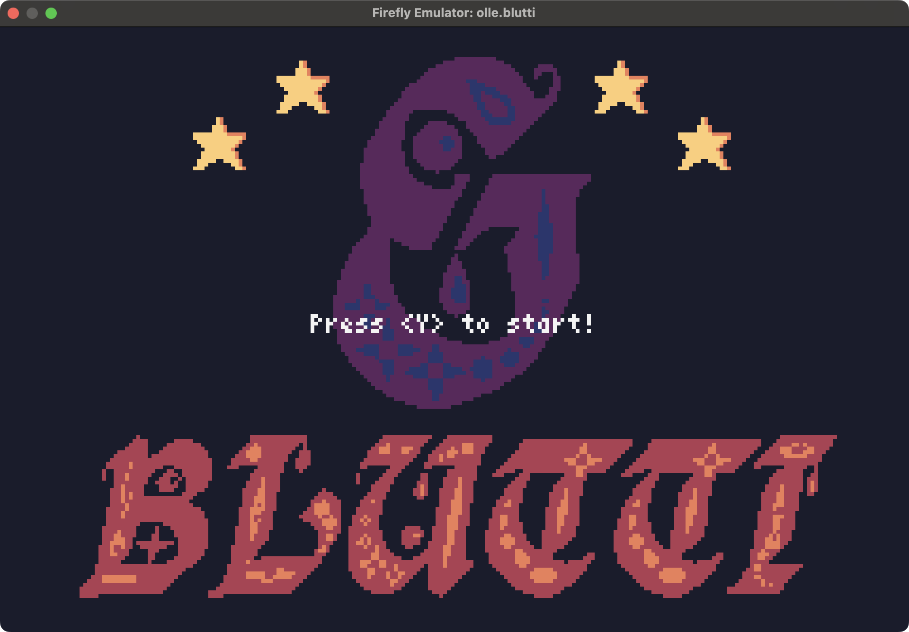

# Blutti


A single screen platformer game with 8x8 tiles for the Firefly Zero handheld
console.

Developed with the Rust programming language.

## Gameplay

Collect enough stars to open up the exit door, each level requires a different
number of stars. Beware of monsters.

- Press "S" to jump
- Press "W" to dash

## Firefly Zero

Firefly Zero is a modern handheld game console with effortless multiplayer. It's fun to play, alone or with friends, and easy to program.

<https://fireflyzero.com/>

## Screenshots

### Level 1



### Level 2



### Level 3



### Level 4



### Level 5



### Title screen




## Installation

Install the Firefly Emulator and the Firefly CLI according to [these instructions](https://docs.fireflyzero.com/user/installation/).

Then you can install Blutti with the following command:

```bash
firefly_cli import olle.blutti
```

After that you can start `firefly-emulator` which will launch the game.

## Cheats

There are cheats available to help with debugging.

### Change level

Use `set-level 0` to load a secret debug level.

```bash
firefly_cli runtime cheat set-level <level>
```

### Add lives
```bash
firefly_cli runtime cheat add-lives <number of lives>
```

### Add points
```bash
firefly_cli runtime cheat add-points <number of points>
```

### Kill Blutti
```bash
firefly_cli runtime cheat die 1
```

### IDDQD / Immortality
```bash
firefly_cli runtime cheat iddqd 1
```

## Create maps

Use [Tiled](https://www.mapeditor.org/) map editor to create maps. Load the
project file `assets/blutti-spritesheet.tsx`. Draw the level in the first tile
layer and add monsters in the first object layer. Use the custom property
`velocity` to set how fast the monster should move. Set a negative values to
make the monster start by moving left.

### Map properties
The map should have the following custom properties:

- `background_color` - A FireflyColor class for the background color of the
level.
- `font_color` - A FireflyColor class for the font color of text in the level.
- `stars` - An int with how many collected stars are needed to finish the
level.
- `start_position` - A Point class defining the position where the player
should start.
- `particle_chance` - How often particles spawn, between 1 and 100.
- `particle_sprite` - ID of the first sprite in the particle animation.

### Monsters

Monsters should be added to the Monsters layer of the level.
The class of the monster should be set to `Monster`.

The properties available on the Monster are:

- `collision` - Type of collision.
  - `Deadly` kills player that touches it.
  - `Blocking` allows player to stand on the monster without dying.
  - `None` Allows player to walk through the monster.
- `frames` - Number of frames in animation. The sprites following the selected
  sprite will be used to build an animation.
- `gravity` - Whether gravity should affect the monster.
- `movement` - Type of movement.
  - `TurnsAtEdge` makes monster turn when reaching edge of a ledge.
  - `FollowsPlayer` makes monster move towards player.
  - `Moving` makes monster ignore edges of ledges.
- `reverse_sprites` - ID of first sprite to use when reversing direction. Set
  to `-1` to use same as the normal direction.
- `velocity` - The initial speed in X and Y direction.

### Multi tile monsters

It is possible to create monsters made up of multiple tiles, such as bosses or
platforms.

To create a multi tile monster, create a new object layer for that monster.
Set the class to `SingleEntity` and set the `width` and `height` properties to
the width and height in pixels. Then add the tiles that make up the object to
the layer. Use the properties on the first tile to set the properties for the
monster. Make sure that all the tiles are connected in a rectangle with no
missing tiles.

### Exporting level data

Once the map is finished, it can be exported using the `Blutti map format` to
the `assets` directory..

The filename (without extension) has to be added to the `LEVELS` const at the
top of `src/constants.rs`. The position in the array defines when it will show
up in the game. Finally, a reference to the file needs to be added under the
`files` section in `firefly.toml` with the attribute `copy` set to `true`.

### TileCollider description

When adding new tiles to the spritesheet, remember to update the `COLLISION`
array with collision info for each tile.

- `TileCollider::Full` - Tile that player and monsters can't enter.
- `TileCollider::Climbable` - Tiles that can be climbed, such as ladders.
- `TileCollider::Collectable` - Tiles that can be collected and gives points.
- `TileCollider::Star` - A collectable star that gives points.
- `TileCollider::ExtraLife` - A powerup that gives an extra life.
- `TileCollider::Exit` - Used to exit the level when enough stars are collected.
- `TileCollider::Deadly` - Tile that the player will die when entering.
- `TileCollider::Slippery` - Causes player to slide and be unable to change
direction.
- `TileCollider::None` - Empty tile that player and monsters can walk through.

## Credits

- Programming: Olle Wreede
- Graphics: Olle Wreede
- Level design: Olle Wreede
- Music: [Zane Little
Music](https://opengameart.org/content/spooky-action-loop-hallow-quest)
- SFX: [@Shades](https://soundcloud.com/noshades),
[Luke.RUSTLTD](https://opengameart.org/content/10-8bit-coin-sounds),
[sauer2](https://opengameart.org/content/oldschool-win-and-die-jump-and-run-sounds)
- Map editor: [Tiled](https://www.mapeditor.org/)

Music and sound effects are CC0 public domain.

## License

Published under the MIT License.
