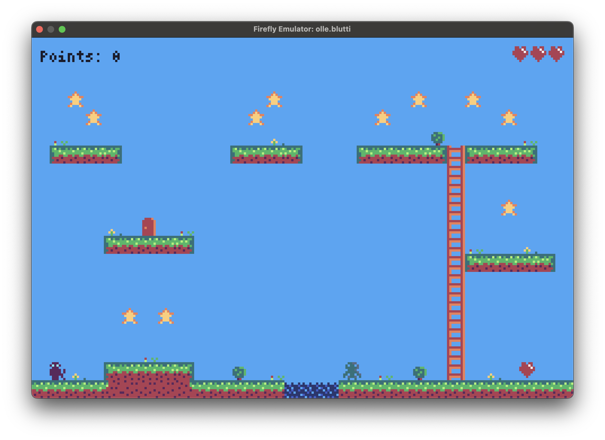

# Blutti



A single screen platformer game with 8x8 tiles for the Firefly Zero handheld
console.

Develeoped with the Rust programming language.

## Gameplay

Collect enough stars to open up the exit door, each level requires a different
number of stars. Beware of monsters.

Press "A" (south button) to jump, press "X" (west button) to dash.

## Installation

Install the Firefly Emulator and the Firefly CLI according to [these instructions](https://docs.fireflyzero.com/user/installation/). 

Then you can install Blutti with the following command:

```
firefly_cli import olle.blutti 
```

After that you can start `firefly-emulator` which will launch the game.

## Create maps

Use [Tiled](https://www.mapeditor.org/) mapeditor to create maps. Load the
project file `assets/blutti-spritesheet.tsx`. Draw the level in the first tile
layer and add monsters in the first object layer. Use the custom property
`movement` to set how fast the monster should move. Set a negative values to
make the monster start by moving left.

The map should have the following custom properties:

- `background_color` - A FireflyColor class for the background color of the
level.
- `font_color` - A FireflyColor class for the font color of text in the level.
- `stars` - An int with how many collected stars are needed to finish the
level.
- `start_position` - A Point class defining the position where the player
should start.

Once the map is finished, it can be exported using the `Blutti map format` to
the `assets` directory..

The filename (without extension) has to be added to the `LEVELS` const at the
top of `src/main.rs`. The position in the array defines when it will show up
in the game. Finally, a reference to the file needs to be added under the
`files` section in `firefly.toml` with the attribute `copy` set to `true`.

When adding new tiles to the spritesheet, remember to update the `COLLISION`
array with collision info for each tile.

- `TileCollider::Full` - Tile that player and monsters can't enter.
- `TileCollider::Climbable` - Tiles that can be climbed, such as ladders.
- `TileCollider::Collectable` - Something that can be picked up.
- `TileCollider::Deadly` - Tile that the player will die when entering.
- `TileCollider::Slippery` - Causes player to slide and be unable to change
direction.
- `TileCollider::None` - Empty tile that player and monsters can walk through.

## Firefly Zero

Firefly Zero is a modern handheld game console with effortless multiplayer. It's fun to play, alone or with friends, and easy to program.

https://fireflyzero.com/

## Credits

- Programming: Olle Wreede
- Graphics: Olle Wreede
- Music: Zane Little Music
- SFX: @Shades, Luke.RUSTLTD, sauer2
- Map editor: [Tiled](https://www.mapeditor.org/)

## License

Published under the MIT License.
